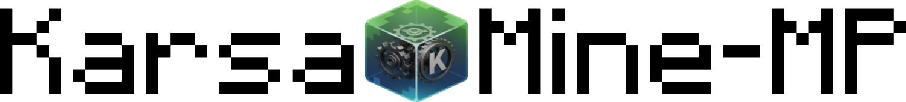

	<a href="https://pmmp.io">
		<picture>
			<source srcset=".github/readme/karsamine-dark.png" media="(prefers-color-scheme: dark)">
			
		</picture>
	</a> 
	<b>A highly customisable, open-source fork of PocketMine-MP for Minecraft: Bedrock Edition, written in PHP</b>

	
	

## What is this?
KarsaMine‑MP is a highly customisable server software for Minecraft: Bedrock Edition, written in PHP. It is a fork of [NetherGamesMC/PocketMine‑MP](https://github.com/NetherGamesMC/PocketMine-MP) (which itself descends from [pmmp/PocketMine‑MP](https://github.com/pmmp/PocketMine-MP)) and is maintained for use on the KirizaNetwork server.

## Features
- Custom patches and fixes targeted at KirizaNetwork's production use (stability and performance optimisations).
- Backported and organisation-specific bug fixes which may not yet exist upstream.
- Updated Bedrock protocol and data integrations to support newer Bedrock clients.
- We selectively merge pull requests that upstream has not yet merged and maintain additional behaviour fixes on top of the NetherGamesMC fork.

These differences reflect the needs of our network and do not imply upstream PocketMine‑MP lacks merit, KarsaMine‑MP is simply tailored for KirizaNetwork's specific requirements.

## :x: KarsaMine‑MP is NOT a vanilla Minecraft server software
KarsaMine‑MP is not intended to be a drop‑in replacement for the official Mojang server. Neither is PocketMine‑MP. Many vanilla features are missing or implemented differently (for example: exact vanilla world generation, full redstone mechanics, some mob behaviours and AI). If you require a pure vanilla Bedrock experience, please use the [official Minecraft: Bedrock server](https://minecraft.net/download/server/bedrock) provided by Mojang.

If you need vanilla behaviour that KarsaMine‑MP lacks, you may be able to approximate it with community plugins (e.g. via Poggit) or by writing custom plugins — however, some behaviours are difficult or impossible to replicate fully in a third‑party server implementation.

## Why this fork exists
KarsaMine‑MP exists to provide a PocketMine‑MP fork maintained specifically for KirizaNetwork.

Unlike NetherGamesMC's distribution, which tracks the upstream pmmp `stable` branch, KarsaMine‑MP tracks the pmmp `next-major` branch. The `next-major` branch contains a number of backward‑incompatible changes and API/behaviour adjustments. Because we follow `next-major` and apply selective merges, KarsaMine‑MP deliberately diverges from upstream in order to provide features and fixes needed in production.

We also cherry‑pick and merge pull requests (including fixes not yet merged upstream) and apply additional behavioural fixes on top of the NetherGamesMC fork where necessary for KirizaNetwork's operation.

Lineage: this repository is a fork of NetherGamesMC/PocketMine‑MP, which itself is a fork of pmmp/PocketMine‑MP. KarsaMine‑MP is independently maintained by KirizaNetwork and is not affiliated with Mojang.

## Compatibility
- PHP: This project requires PHP 8.3. A 64‑bit CLI PHP build is required.
- Supported Bedrock client versions: KarsaMine‑MP aims to support Bedrock clients from 1.20.0 up to 1.21.121.
- Plugins: Because KarsaMine‑MP follows pmmp's `next-major` branch and includes additional merges and behaviour fixes, some upstream plugins (targeting pmmp `stable`) may require adjustments. Test plugins carefully and report compatibility issues with logs and client versions.

## Licence and attribution
This project is licensed under the GNU Lesser General Public Licence v3 (LGPL‑3.0). See the [LICENSE](/LICENSE) file for details.

KarsaMine‑MP is a fork of NetherGamesMC/PocketMine‑MP (a fork of pmmp/PocketMine‑MP). All brands and trademarks belong to their respective owners. KarsaMine‑MP is not Mojang‑approved software, nor is it associated with Mojang.